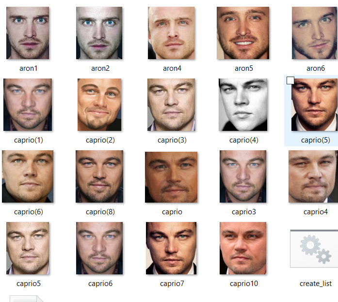

# face_recognition
Projects are divided by several modules:

**orb.py:** Uses orb descriptor on image and filters keypoints using given window (selectKP)

**face_recog.py:** Using Haar Cascade, detect face. and provide window.Uses orb.py to find the keypoints in the face. 

**File_parser:** using directories.txt, it loads the picture and returns an array 

**simple_approach.py :** Using normalization, seperate,cluster,and ratio face function, it finds the distace between eyes and to the mouth region, and trains and predict with  decision tree.

#SAMPLE PICTURE 

#PERFORMANCE: 
*HIGH SCORE == CLASS*

File |	 ARON-SCORE |	 CAPRIO-SCORE	|Mis-Classification| 
-----|-------|--------|------|			
aron1.jpg |	 0.375 |	 0.625 | TRUE|	
aron2.jpg |	 0.660377358491 |	 0.339622641509 ||	
aron4.jpg |	 0.611111111111 |	 0.388888888889 ||	
aron5.jpg |	 0.40243902439 |	 0.59756097561 |TRUE|	
aron6.jpg |	 0.614035087719 |	 0.385964912281 ||	
caprio(1).jpg |	 0.0698924731183 |	 0.930107526882 ||	
caprio(2).jpg |	 0.25 |	 0.75 ||	
caprio(3).jpg |	 0.833333333333 |	 0.166666666667 |TRUE|	
caprio(4).jpg |	 0.309523809524 |	 0.690476190476 ||	
caprio(5).jpg |	 0.286885245902 |	 0.713114754098 ||	
caprio(6).jpg |	 0.421686746988 |	 0.578313253012 ||	
caprio(8).jpg |	 0.227272727273 |	 0.772727272727 ||	
caprio.jpg |	 1.0 |	 0.0 |TRUE|	
caprio10.jpg |	 0.466666666667 |	 0.533333333333 ||	
caprio3.jpg |	 0.136842105263 |	 0.863157894737 ||	
caprio4.jpg |	 0.330188679245 |	 0.669811320755 ||	
caprio5.jpg |	 0.774193548387 |	 0.225806451613 |TRUE|	
caprio6.jpg |	 0.13829787234 |	 0.86170212766 ||	
caprio7.jpg |	 0.253623188406 |	 0.746376811594 ||	

